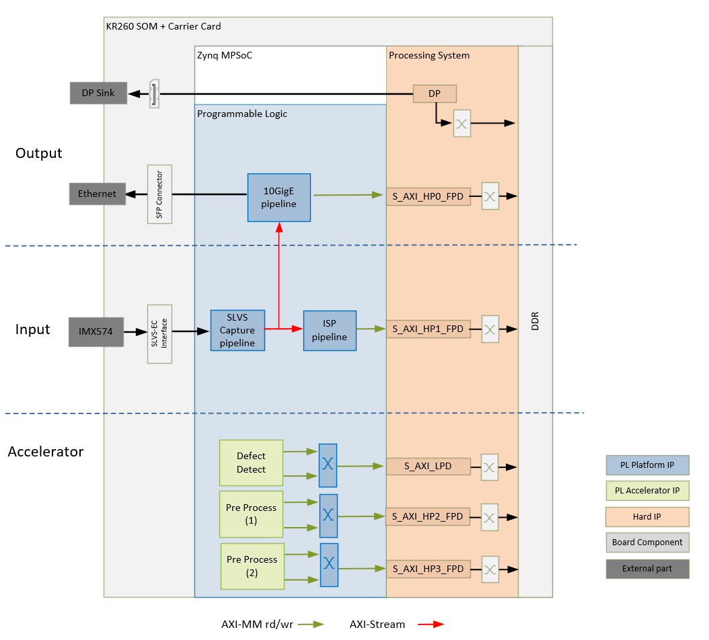
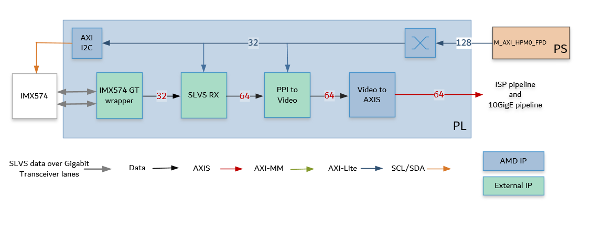
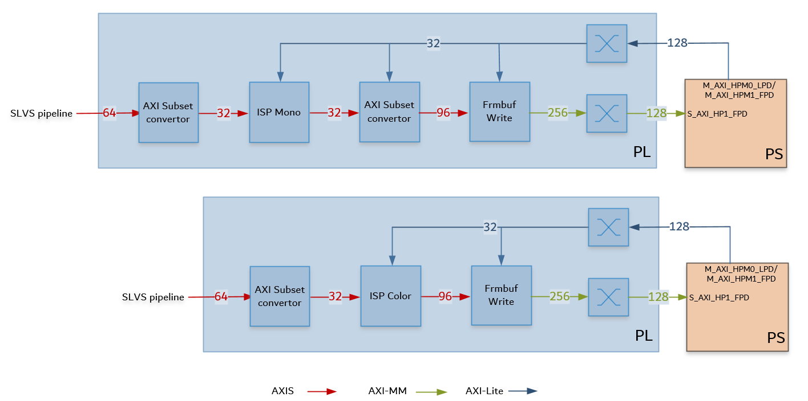
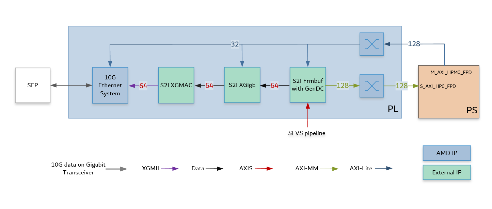

<table class="sphinxhide">
 <tr>
   <td align="center"><h1>Kria&trade; KR260 Robotics Starter Kit</h1>
   </td>
 </tr>
 <tr>
 <td align="center"><h1>Machine Vision Camera Tutorial</h1>
 
 </td>
 </tr>
</table>

# Hardware Architecture of the Platform

## Introduction
This section describes the design implemented in the programmable logic (PL). The following figure shows the top-level hardware architecture of the reference design.

At a high-level, the design comprises of four pipelines:

* Capture/Input pipeline: This comprises of pipelines through which video data is captured.

  * Capture images from a file source (PS)
  * SLVS-EC capture pipeline (PL)

* Image Sensor Processing (ISP) pipeline: This comprises of functions to improve image quality

  * ISP for color stream (PL)
  * ISP for mono stream (PL)

* Display/Output pipeline: This comprises of pipelines through which video data is output.

  * Display port as sink for output images (PS)
  * 10G Ethernet pipeline (PL)

* Accelerator pipeline: This comprises of overlay accelerator functions integrated into the platform using AMD Vitis&trade;.

  * The Pre-Process block modifies the input data as required by the Defect Detection function (PL).
  * The Defect Detection block identifies defects in a mango (PL + PS).
  * Both Pre-Process and Defect Detection use Vitis Vision Library functions.

> **NOTE:** The PS interconnects in the figure are conceptual.

## Capture Pipeline

SLVS-EC Capture

A capture pipeline receives video frames from an external source and writes it into memory or streams it to another IP. The SLVS-EC receive capture pipeline is shown in the following figure.

This pipeline consists of four components: two that are controlled by the application processing unit (APU) via an AXI4-Lite based register interface; one is controlled by the APU via an Inter Integrated Circuit (I2C) register interface, and one is configured statically.

* The Sony IMX547 CMOS active pixel image sensor, sends sensor data to the SLVS RX IP through a two-lane Gigabit Trasceiver (GT) interface. It is controlled and programmed by via an I2C interface using an AXI I2C controller in the PL. The Framos Sensor Module host the Sony IMX547 camera sensor, and connects to the  KR260 carrier card via a flex cable and Framos Sensor Adaptor (FSA). For more information, refer to [MV Camera Sensor](sensor.md)

* The Framos SLVS-EC RX IP Core is a receiver that handles the byte-to-pixel conversion of the incoming sensor data stream. The IP Core provided by Framos encompasses Xilinx GTs, and the logic to process the sensor image and provide it on Parallel Pixel Interface (PPI). For more information, refer to [FRAMOS SLVS-EC RX IP CORE](https://www.framos.com/en/framos-slvs-ec-rx-ip-core)

* The Framos PPI to Video IP Core converts the PPI data to a parallel video stream 

* The LogiCORE™ IP Video In to AXI4-Stream Video In to AXI4-Stream is designed to interface to video data (clocked parallel video data with synchronization signals - active video with either syncs, blanks or both) and convert it to the AXI4-Stream Video Protocol Interface. For more information, refer to [Video In to AXI4-Stream IP Product Guide](https://docs.amd.com/r/en-US/pg043_v_vid_in_axi4s/Video-In-to-AXI4-Stream-v5.0-LogiCORE-IP-Product-Guide)

The IPs in this pipeline are configured to transport 4 ppc at 237.6 MHz.

An [AXI4-Stream Broadcaster IP](https://docs.amd.com/r/en-US/pg085-axi4stream-infrastructure/AXI4-Stream-Broadcaster) is used in the PL to broadcast 64-bit AXIS Video data from the SLVS_EC pipeline to the ISP pipeline and 10GigE pipeline.  

## Image Sensor Processing (ISP) pipeline

The ISP pipeline converts the sensor data to Y8 format, resizes the image to 1920x1080p and writes it to memory. The acceleration pipeline reads these frames. ISP pipeline is shown in the following figure.

* The [AXI subset converter](https://docs.amd.com/r/en-US/pg085-axi4stream-infrastructure/AXI4-Stream-Subset-Converter), is a statically-configured IP core that converts the 64-bit AXI4-Stream from the capture pipeline to a 32-bit AXI4-Stream output data by dropping the least significant bit (LSB) of each data word. The most significant bits carry the relevant information. 

* The [ISP function](https://docs.amd.com/r/en-US/Vitis_Libraries/vision/ISPpipeline-bm.html) from the AMD Vitis&trade; Vision libraries is a collection of functions that enhances the overall visual quality of the raw image from the sensor. 

  Functions implemented for color sensor
  
  * Gain Control
  * Demoaosaicing
  * Auto white balancing
  * Color correction
  * Gamma correction
  * Resizing to 1920x1080

  For color the raw image is converted to BGR8 format, 24 bits per pixel, 96-bits for 4ppc the 
   
  Functions implemented for mono sensor
  
  * Gain Control
  * Gamma correction
  * Resizing to 1920x1080
  
  For mono the raw image is converted to Y8 format, 8 bits per pixel, 32-bits for 4ppc the 

* The [AXI subset converter](https://docs.amd.com/r/en-US/pg085-axi4stream-infrastructure/AXI4-Stream-Subset-Converter), is a statically-configured IP core that converts the 32-bit AXI4-Stream input data to a 96-bit AXI4-Stream output data by adding zeros to the most significant bit (MSB) of each data word. At four ppc, the AXI4-Stream width is 96-bits. This is applicable to the mono pipeline only.

* The video frame buffer takes AXI4-Stream (RGB8 for color and Y8 for mono) input data and converts it to AXI4-MM format, which is written to memory. The AXI-MM (Memory Mapped) interface is connected to the S_AXI port of the PS. For each video frame transfer, an interrupt is generated. A general purpose I/O (GPIO) is used to reset the IP. For more information, see the ([Video Frame Buffer Read and Video Frame Buffer Write LogiCORE IP Product Guide](https://docs.amd.com/r/en-US/pg278-v-frmbuf)).

All the IPs in this pipeline are configured to transport 4 ppc at 237.6 MHz.

## Output pipeline - 10GigE

The 10GigE pipeline transfers the captured raw data to the host system via an SFP connection. The block diagram of the 10GigE Vision pipeline is shown below. The major blocks in the pipeline are provided by Sensor to Image (S2I)

The pipeline consists of following modules:

* **Framebuffer with Gen DC**: The AXI4 stream output of the SLVS-EC IP pipeline is forwarded to Framebuffer IP. This IP buffers the image data in memory. The Framebuffer also prepares the data to be sent in GenICam GenDC format, which allows for sending different types of data, for example, raw image, preprocessed image, metadata etc in a data container. It sends ethernet packet size data chunks to the 10GigE packet composer(XGigE).

* **XGigE core**: This module handles all the low-level networking features to the rest of the system. It forms the GigE Vision stream channel and provides networking interface for the CPU system.

* **10GigE MAC**: This module implements the Media Access Controller (MAC) and sends data to the PHY over XGMII (Media-Independant-Interface).

* The [AMD 10G/25G High Speed Ethernet Subsystem](https://docs.amd.com/r/en-US/pg210-25g-ethernet)is configured to support the  physical coding sublayer/physical medium attachment (PCS/PMA) functions at 10G speeds. The IP implements the PHY layer of the 10GigE protocol and transmits the packetized sensor data on the Gigabit transceiver

## Resource Utilization after Synthesis

| Blocks          | LUT     | FF      | BRAM   | URAM  | DSP   | GT      |
| :-------------  |:--------| :-----  | :------| :-----| :-----| :------ |
| SLVS-EC         | 1886    | 2948    | 22.5   | 0     | 0     | 2       |
| 10GigE IPs      | 13889   | 18809   | 35     | 0     | 0     | 0       |
| Ethernet System | 2745    | 5010    | 0      | 0     | 0     | 1       |
| ISP-Color       | 24530   | 24744   | 26     | 14    | 166   | 0       |
| ISP-Mono        | 8939    | 9787    | 9      | 6     | 26    | 0       |

## References

* To get the 10GigE IP license, [contact Sensor to Image S2I](https://www.euresys.com/en/About-us/Contact-us).
* S2I Release note [here](https://www.euresys.com/en/About-us/Blog-event/News/New-GigE-Vision-Viewer-for-AMD-Xilinx-Kria-KR260-R).
* Download the packages from S2I [here](https://www.euresys.com/en/Support/Download-area).

## Next Steps

* [SW Architecture of the platform](sw_arch_platform_dd.md)
* [HW Architecture of the accelerator](hw_arch_accel_dd.md)
* Go back to the [Introduction](introduction.md)

Copyright © 2023–2024 Advanced Micro Devices, Inc.

<a href="https://www.amd.com/en/corporate/copyright">Terms and Conditions</a>

