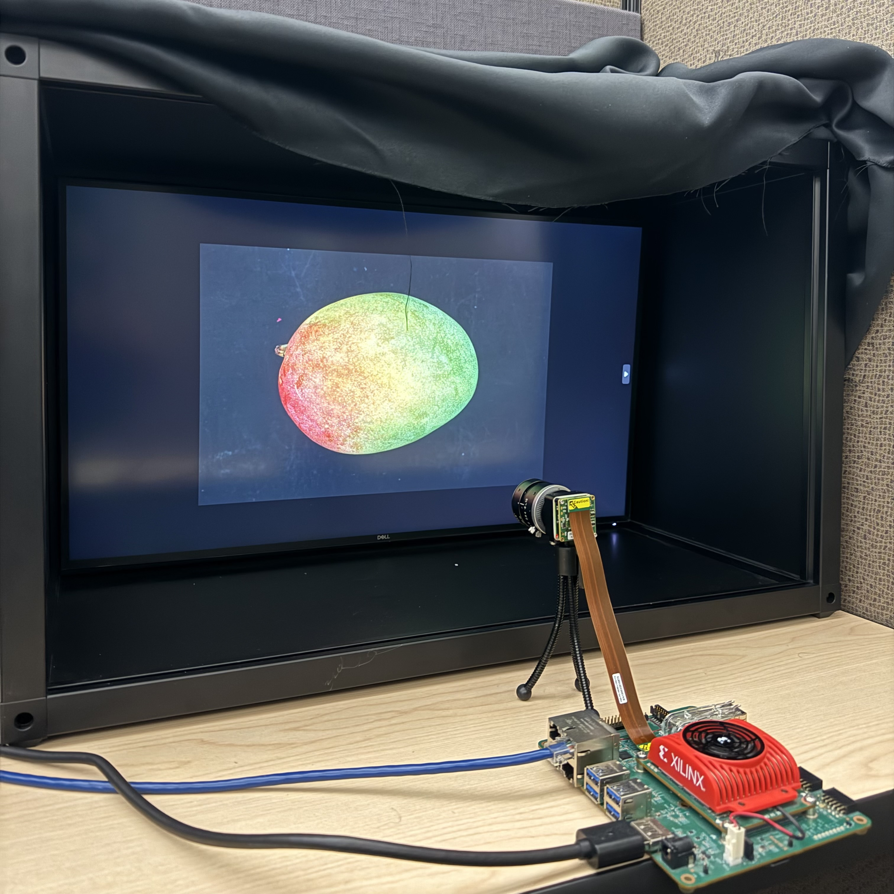
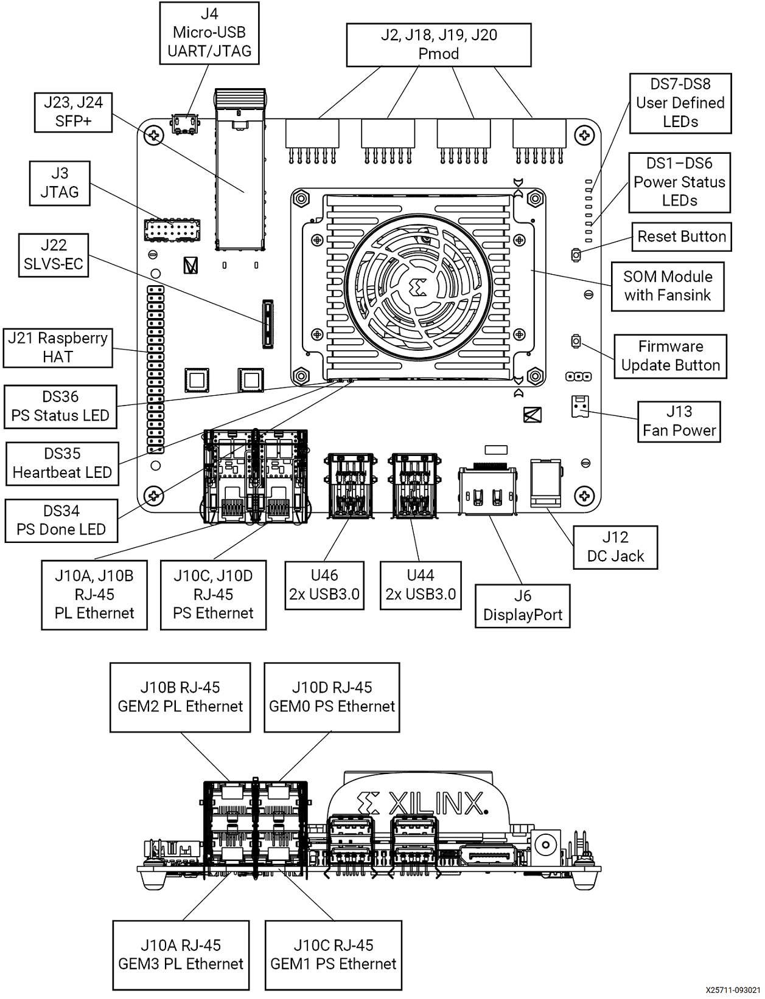
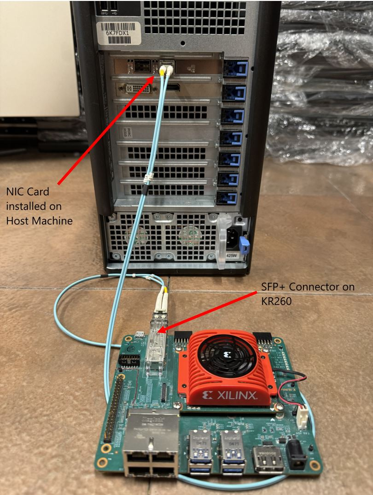
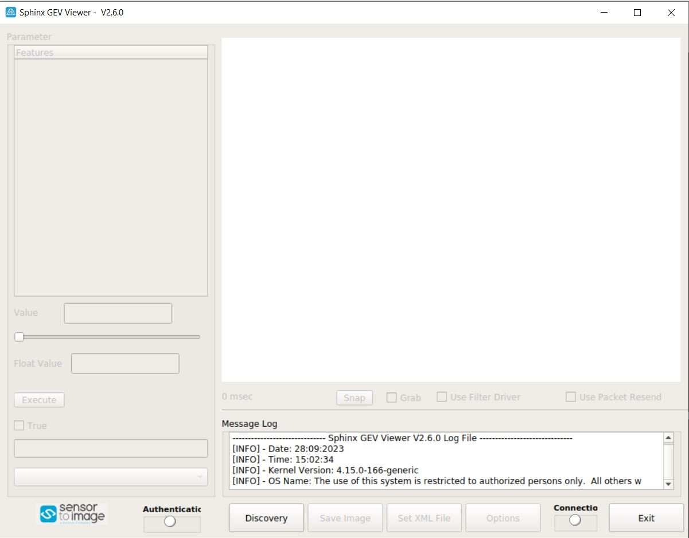
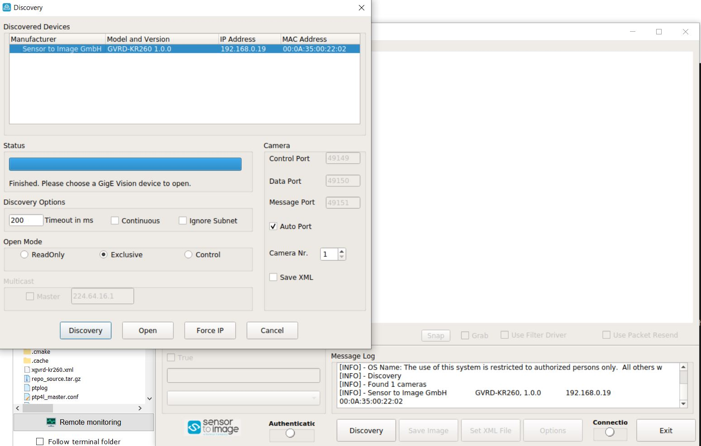
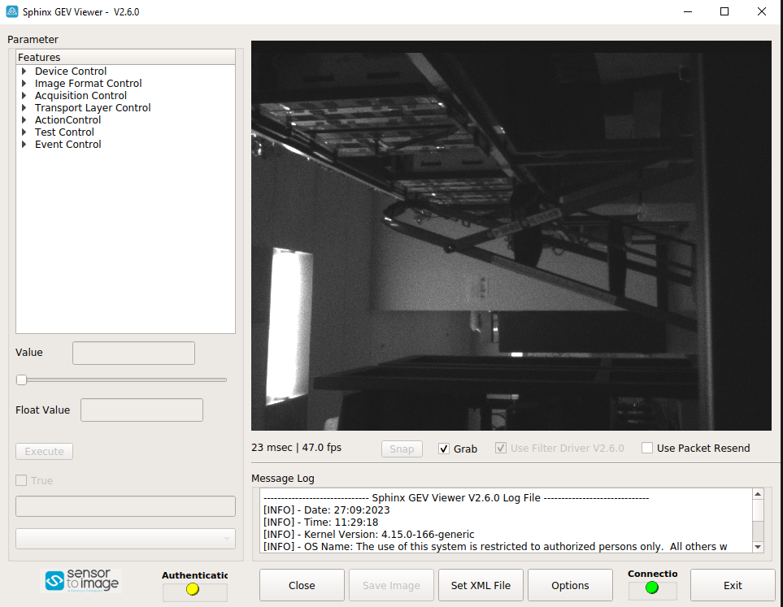
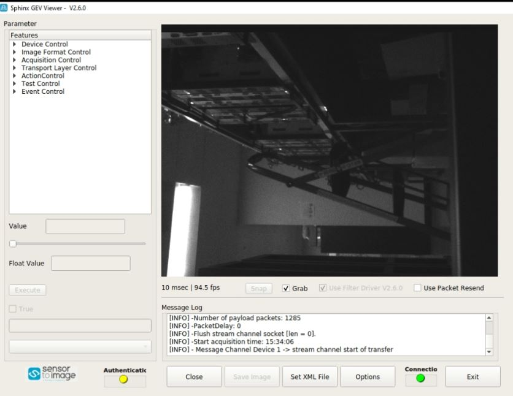
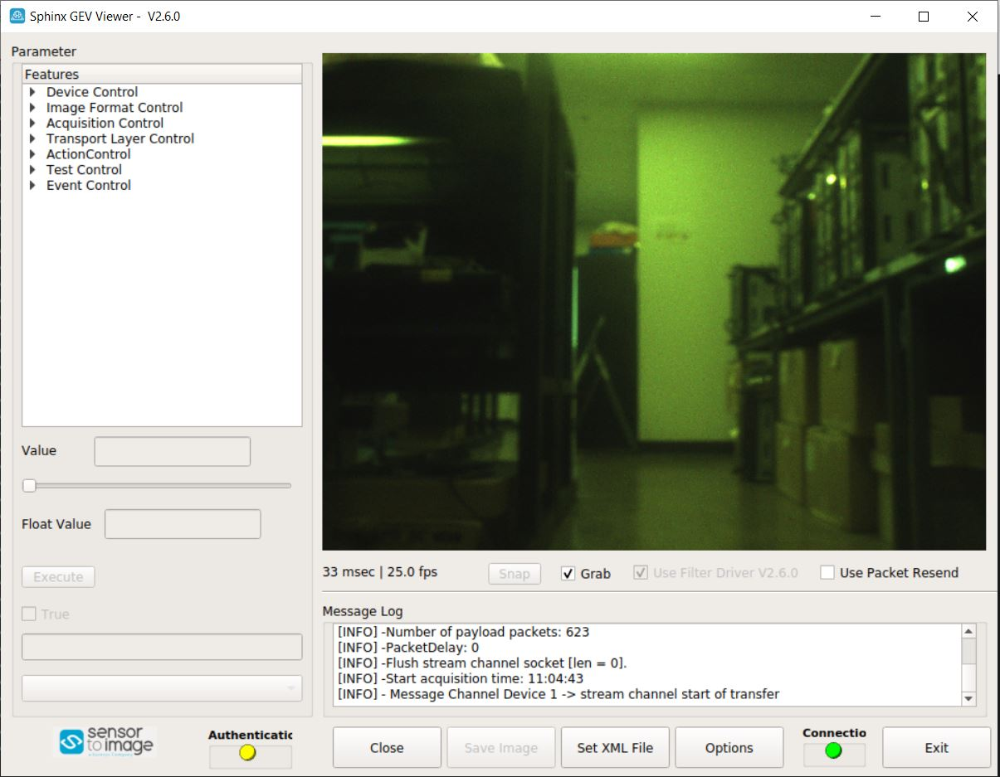
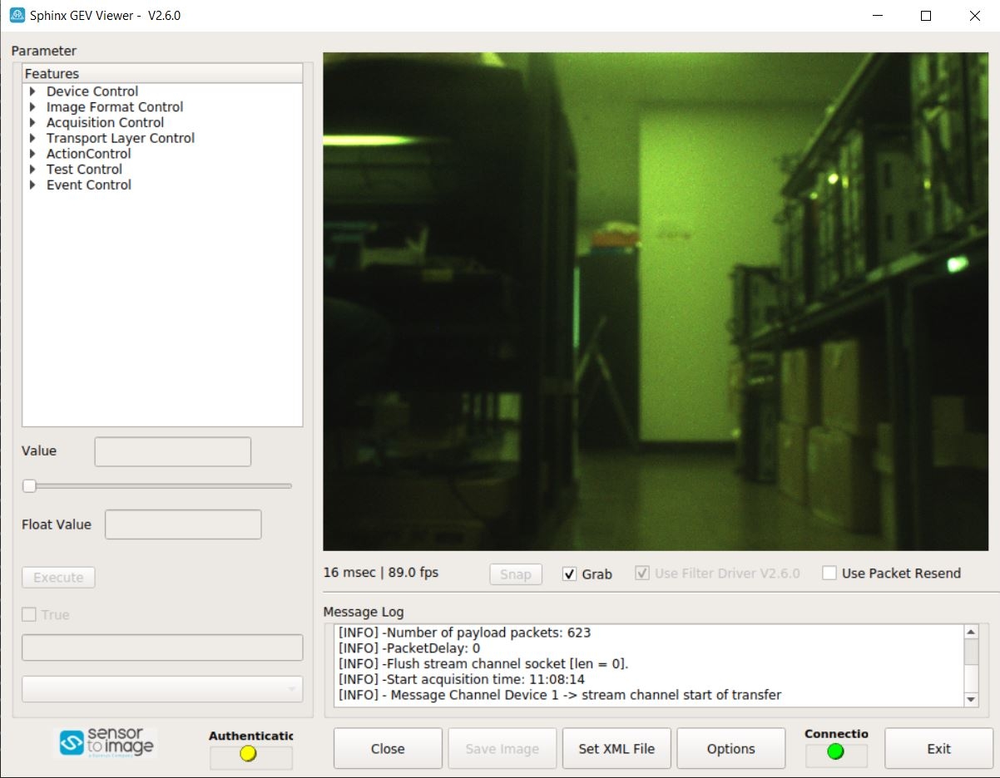
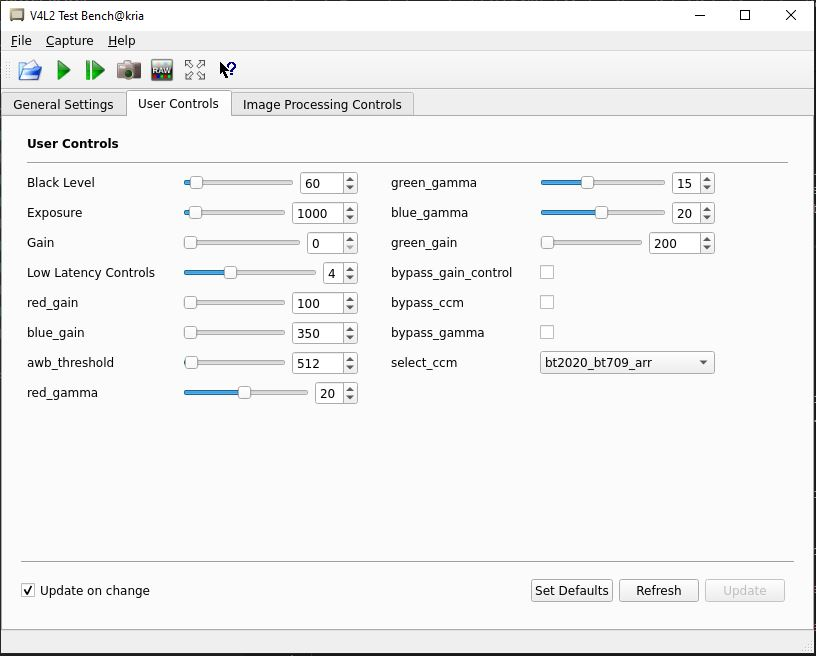

<table class="sphinxhide">
 <tr>
   <td align="center"><h1>Kria&trade; KR260 Robotics Starter Kit</h1>
   </td>
 </tr>
 <tr>
 <td align="center"><h1>Machine Vision Camera Tutorial</h1>

 </td>
 </tr>
</table>

# 10GigE Machine Vision Defect Detect Application Deployment

## Introduction to the Test Environment

This document shows how to set up the board and run the **MV-Defect Detect** and **10GigE** applications.

### Hardware Requirements

1. KR260 Robotics Starter Kit

2. KR260 Power Supply & Adapter (Included with KR260 Robotics Starter Kit)

3. Cat 5e Ethernet Cable (Included with KR260 Robotics Starter Kit)

4. USB-A to micro-B Cable (Included with KR260 Robotics Starter Kit)

5. 16GB MicroSD Cards (Included with KR260 Robotics Starter Kit)

6. 1080p Monitor and Power Supply

7. Display Port Cable

8. 1-Windows PC, for capturing the UART/console logs from KR260 board, and to act as host PC

9. [Fiber Optic Cable](https://www.amazon.com/dp/B089K3VYZ1)

10. [Sony IMX547 Monochrome Camera sensor Module](https://www.xilinx.com/products/som/kria/kr260-robotics-starter-kit/imx547-camera-kit-monochrome.html) OR [Sony IMX547 Color Camera sensor Module](https://www.xilinx.com/products/som/kria/kr260-robotics-starter-kit/imx547-camera-kit-color.html)

11. [10G NIC Card](https://www.amazon.com/dp/B06X9T683K)

12. [Two 10G SFP+ Transceivers](https://www.amazon.com/dp/B08BP55663)

### Setting Up the Live Source for Defect-Detect

When setting up the SOM Board for the live camera source capturing mango image displayed on a monitor, adhere to the following guidelines:

- Keep the IMX547 Camera module firmly held in a static position, preferably on a tripod and at a height of ~17 cm from the base.
- IMX547 Camera module should be facing straight directly to the monitor(not at an angle) at an appropriate distance of ~35 cm from the screen.
- According to the model of the monitor(Dell U2718Q Ultra Sharp 27 used here), set brightness and contrast to 94 and 85, respectively. Optimal values may be different for different make/model.
- The setup should be covered completely so that no outside light is captured by the sensor.
- To avoid over exposure of light, do NOT place the monitor opposite to an open door or window.
- Ensure that the live source is able to capture the mango completely.
- The camera should be focused ONLY on the mango image that was displayed.
- The setup should be as follows:

    

   **Note**: The above setup should be covered completely so that no outisde light is captured by the sensor. In the setup above, a black cloth is used to cover the setup entirely. 
   If the preview image is not satisfactory, adjust the above mentioned parameters. Adjust the camera aperture using the adjustment ring on the sensor lens. For Monochrome and Color sensor set 
   it to 1.6 and 0.8 respectively.

### Setting Up the Test Environment

***Note***: Ensure that the [Gstreamer packages](https://gstreamer.freedesktop.org/documentation/installing/on-linux.html?gi-language=c) are installed on Linux PC. If Linux distribution is on Ubuntu, make sure its version is at least **16.04**.

Download all the sample mango images from the [Cofilab site](http://www.cofilab.com/wp-content/downloads/DB_Mango.rar) to the Linux PC.

***Note***: If the file fails to download, copy the link and open in a new browser tab to download the file.

As the downloaded images are in a JPG format, convert them into the GRAY8 (Y8) or RGB (RGB) format using the following steps:

1. Unzip the downloaded rar file.

2. In the Linux PC, go to `DB_mango`.

3. Clone the repo and navigate to scripts directory:

   ```bash
   git clone https://github.com/Xilinx/mv-defect-detect
   cd mv-defect-detect/scripts
   ```

4. Copy the scripts to `DB_Mango` directory

5. Run the scripts as follows:

   ```shell
   ./convert_jpeg_y8.sh >& file.txt     For GRAY8 format

   ./convert_jpeg_rgb.sh >& file.txt    For RGB format
   ```

   Once the above command is completed, the script produces `input_video.y8 | input_video.rgb` as input to the MV-Defect-Detect application.

6. Copy the video from the Linux PC to the SOM board. If copied to an SD card, it can be found in `/boot/firmware/<input_video.y8/rgb>`. For containers to access the file, copy it to `/tmp/` and containers can then also access it from its /tmp/ folder. Then copy it to `/home/` directory in the container.

   > ***Note***: Delete all files *except* `input_video.y8 or input_video.rgb`.

The MV-Defect-Detect application's design takes, processes, and displays images on to the monitor.

See [Known Issues and Limitations](known_issues.md) with the MV-Defect-Detect application.

### SOM Board setup

Refer to the following KR260 Board and Interface layout for connector reference numbers:




1. Go through the [Booting Kria Starter Kit Linux](../../kria_starterkit_linux_boot.md) to complete minimum setup required to boot Linux before continuing with the instructions in this page.

2. Ensure that the board is powered off. Connect IMX547 Monochrome sensor module to J22 in KR260 using flex cable.

3. Keep the KR260 board and sensor module firmly held in a static position.

4. Connect the Ethernet cable from PS ethernet \'J10C\' to local network with DHCP enabled to install packages.

5. Connect the fiber optic cable to SFP+ connector in the KR260 board, other end to host machine (Windows/Ubuntu) NIC card as follows:

    

### Tested Artifacts

Testing was performed with the following artifacts:

| Component                           | Version          |
|-------------------------------------|------------------|
| Boot Firmware                       | K26-BootFW-01.01 |
| Linux Kernel                        | 5.15.0-1030      |
| xlnx-firmware-kr260-mv-camera-mono  | 0.12-0xlnx2      |
| xlnx-firmware-kr260-mv-camera-color | 0.12-0xlnx2      |

### Host Machine Setup

* Check the available network interfaces before inserting the 10G NIC card using:

  - `ifconfig -a` for ubuntu host
  - `ipconfig /all` for windows host

* Install the 10Gb PCIe NIC Network Card in the PCIe slot of host machine.

* Connect the fiber optic cable one end to the NIC card in host machine and the other end to the KR260 board SFP+ connector.

* The newly inserted NIC card shows the new interface in the host machine. You can run the same command to verify that:

  - `ifconfig -a` for ubuntu host
  - `ipconfig /all` for windows host

**Note:** On windows host, ensure that the network related drivers are installed from the [link](https://www.euresys.com/en/Products/IP-Cores/Vision-Standard-IP-Cores-for-FPGA/GigE-Vision-IP-Core-(2)), before running the Host Sphinx application.

**Note:** Ensure that the 10GigE interface is enabled on the Host PC before loading MV-Camera application firmware.

## Installing the Application packages

Make sure that you had gone through  [Booting Kria Starter Kit Linux](../../kria_starterkit_linux_boot.md) as indicated in the previous step to complete the minimum setup required to boot Linux before continuing with instructions in this page.

Install the latest application packages.

1. Get the list of available packages in the feed:

      ```bash
        sudo xmutil getpkgs
      ```

2. Install either mono/color application firmware package based on the image sensor that you want to use.

    ```bash
      sudo apt install xlnx-firmware-kr260-mv-camera-mono     //For Monochrome Sensor
      sudo apt install xlnx-firmware-kr260-mv-camera-color    //For Color Sensor
    ```

3. Install `qv4l2`, GUI like test bench application for video4linux devices, which can be used to tune the sensor/ISP parameters as an alternative to standard `v4l2-ctl` commands

    ```bash
      sudo apt install qv4l2
    ```
    > **Note**: The default sensor/ISP parameters are set to defect-detection mode, which uses a completely covered setup and blocks sensor from capturing any natural light. Please tune the 
    sensor/ISP settings, via v4l2 commands or GUI, to optimal values based on your lighting conditions for 10Gige or defect-detect in bypass mode. The process to tune the settings are
    outlined in the "Sensor Calibration for the Live Source" further below.

## Docker based application preparation

* Pull the latest docker image for mv-defect-detect using the following command.

  ```bash
    sudo docker pull xilinx/mv-defect-detect:2022.2
  ```

* Find the images installed with the following command:

  ```bash
    sudo docker images
  ```

## Firmware Loading

The MV-Camera application firmware consists of bitstream (bit.bin) and device tree overlay (*dtbo*). The MV-Camera firmware is loaded dynamically on the user request once the ubuntu system is fully booted. Use the *xmutil* utility to list and load the firmware.

***Note***: `xmutil` utility runs only in Ubuntu.

### Dynamically load the application firmware:

* Disable the desktop environment:

    ```bash
       sudo xmutil desktop_disable
    ```

    ***Note***: Executing "xmutil desktop_disable" causes the desktop on the monitor to be disabled. Use any serial terminal to continue issuing Linux commands via port J4 and do not rely completely on the desktop environment.

    After running the application, the desktop environment can be enabled again with:

    ```bash
       sudo xmutil desktop_enable
    ```

* After installing the FW, execute xmutil listapps to verify that it is captured under the listapps function, and to have dfx-mgrd re-scan and register all accelerators in the FW directory tree.

    ```bash
      sudo xmutil listapps
    ```

* To list the available accelerator applications, run:

    ```bash
      sudo xmutil listapps
    ```

> ***Note***: The Active_Slot column shows the application firmware that is currently loaded in the system. The value '-1' indicates that the firmware is not loaded, while the value of '0' indicates that the firmware is loaded. By default, only the *k26-starter-kits* firmware is loaded.

* To load the MV-Camera application firmware, unload the existing firmware and then load either mono/color MV-Camera application firmware based on the sensor connected:

    ```bash
      sudo xmutil unloadapp
      sudo xmutil loadapp kr260-mv-camera-mono      //For Monochrome Sensor
      sudo xmutil loadapp kr260-mv-camera-color     //For Color Sensor
    ```

## Launching the Docker

* Launch the docker using the below command. The firmware must be loaded before launching the docker container.

  ```bash
      sudo docker run \
        --env="DISPLAY" \
        --env="XDG_SESSION_TYPE" \
        --net=host \
        --privileged \
        --volume /tmp:/tmp \
        --volume="$HOME/.Xauthority:/root/.Xauthority:rw" \
        -v /dev:/dev \
        -v /sys:/sys \
        -v /etc/vart.conf:/etc/vart.conf \
        -v /lib/firmware/xilinx:/lib/firmware/xilinx \
        -v /run:/run \
        -h "xlnx-docker" \
        -it xilinx/mv-defect-detect:2022.2 bash
  ```

*  It launches the mv-defect-detect docker image container.

  ```bash
      root@xlnx-docker/#
  ```

## Running the 10GigE Application on Target

The only way to invoke the application is by command line.

>***Note***: Docker starts with the *root* user access. Only one instance of the application can run at a time. Only 2472 x 2128 \@122fps -- 10bpp configuration is validated.

To run the application, follow the steps mentioned below:

1. Run the configure script to configure the media nodes and the IPs in the capture path.

    ```bash
      configure -f mono -r 60         //For Monochrome Sensor at 60fps
      configure -f color -r 60        //For Color Sensor at 60fps
    ```
    ***NOTE**: Valid values for `-r` are 60 and 120. If user does not specify the rate, default value is set to 60 fps.

2. Set Static IP address on the SFP eth interface on the KR260. It should be under same subnet as Host Machines SFP IP

    ```bash
      #Example
      busybox ifconfig eth2 down
      busybox ifconfig eth2 192.168.0.19
    ```

3. Run the eeprom wrapper script.

    ```bash
      update_eeprom_wrapper
    ```
    It asks the user to give a few inputs and gets the following logs (the size of the following xml file might vary):

    ```
    Update eeprom

    file: xgvrd-kr260.xml
    size: 113757
     ```

    > ***Note***: Always select 1 in the Network configuration below.
    >
    > ```
    > 1: 0xFEC00000 (MVDK + ZX5/XU1 / ZC702 / ZC706 / ZCU102)
    > 2: 0xFFA10000
    > ```

    Then, you can select the type of network:

    ```
      1: dhcp
      2: static ip
    ```

    > ***Note***: Select 1 or 2 based on the user network configuration (static or dynamic). If you opt for the static option, enter the following details as well. Below are the example values for the reference.
    >
    > Input ip address (xxx.xxx.xxx.xxx): **192.168.0.19**
    >
    > Input netmask (xxx.xxx.xxx.xxx): **255.255.255.0**
    >
    > Input gateway (xxx.xxx.xxx.xxx):**192.168.0.20**

4. Run the following command and get the interface name, which has memory address like **memory 0xa0060000-a006ffff**.

    a.  `ifconfig -a`

    ```
        eth2: flags=3<UP,BROADCAST>  mtu 1500
        inet 192.168.0.19  netmask 255.255.255.0  broadcast 192.168.0.255
        ether 00:0a:35:00:22:02  txqueuelen 1000  (Ethernet)
        RX packets 0  bytes 0 (0.0 B)
        RX errors 0  dropped 0  overruns 0  frame 0
        TX packets 8  bytes 1156 (1.1 KB)
        TX errors 0  dropped 0 overruns 0  carrier 0  collisions 0
        device interrupt 66  memory 0xa0060000-a006ffff
    ```
      Keyword **memory 0xa0060000-a006ffff** belongs to eth2 port. This interface information is required to feed while running gvrd application on target.

5. Run the *gst-launch* command in the background to trigger the pipeline.

    For 60 fps, run either the following gst launch command or mv-defect-detect application.

    ```bash
      #For Monochrome Sensor
      gst-launch-1.0 v4l2src device=/dev/video0 io-mode=4 ! video/x-raw, width=1920, height=1080, format=GRAY8, framerate=60/1 !  queue ! fakevideosink -v &

      #For Color Sensor
      gst-launch-1.0 v4l2src device=/dev/video0 io-mode=4 ! video/x-raw, width=1920, height=1080, format=RGB, framerate=60/1 !  queue ! fakevideosink -v &
    ```

    For 120 fps, run the following commands:

    ***Note***: MV-Defect-Detect application does not support 120 fps.

    ```bash
      #For Monochrome Sensor
      gst-launch-1.0 v4l2src device=/dev/video0 io-mode=4 ! video/x-raw, width=1920, height=1080, format=GRAY8, framerate=120/1 !  queue ! fakevideosink -v &

      #For Color Sensor
      gst-launch-1.0 v4l2src device=/dev/video0 io-mode=4 ! video/x-raw, width=1920, height=1080, format=RGB, framerate=120/1 !  queue ! fakevideosink -v &
    ```

   > ***Note***: Make sure to terminate the gst-launch process before unloading xlnx-app-kr260-mv-camera.

6. Run the following command to run the gvrd application.

      ```bash
      gvrd <10gige port detail> <mono|color>
      ```

    For example, `gvrd eth2 mono`, `gvrd eth2 color`.

    > ***Note***: Once done with the 10GigE application, to switch to another accelerator application, unload the currently loaded accelerator application firmware by running:
    >
    >```
    > sudo xmutil unloadapp
    >```

7. On Host PC to run the Sphinx application:

    Sphinx GEV Viewer can be downloaded from [here](https://www.euresys.com/en/About-us/Blog-event/News/New-GigE-Vision-Viewer-for-AMD-Xilinx-Kria-KR260-R) along with Sphinx GEV Viewer user guide link to run the Sphinx application.

     **Prerequisites:**

    a). If you are setting the IP statically, make sure that both KR260 and host machine should be on the same network class address.

    - On ubuntu : sudo ifconfig <10G network interface> <IPv4 adress> up

        For Example: `sudo ifconfig enp23s0 192.168.0.10 up`

    - On Windows : Set from network settings – IPv4 IP

    b). To change the MTU Size, follow the procedure as mentioned below:

    - For ubuntu : sudo ifconfig <10G network interface> mtu 9014 up

        For Example: `sudo ifconfig enp23s0 mtu 9014 up`

    - For Windows :
        * Go to settings, navigate to control panel, and select **Network and Sharing Centre**,
        * Select **Change adapter settings**,
        * Right click on the NIC interface on which the place to enable Jumbo Frames and select **Properties**,
        * From the NIC properties, select **Configure**,
        * Click on **Advanced** tab,  
        * In Advanced section, select **Jumbo Frame**,
        * In the Value field **Value** – select 9KB MTU s.

    c). Sphinx GEV Viewer GUI start-up window should look something like below image. If all the control elements are not 
    visible, you can reduce the size of text, apps and other items in the Display settings.

      
    
    d). On the Sphinx GUI click on `Discovery` to establish a connection from KR260 over SFP. Then click on
    Discovery --> Open

      

    e). To get the maximum fps in the Sphinx GUI, you can change the draw value in Sphinx --> Options based on the host type  (windows or ubuntu)

      - On ubuntu host,

        For 60 fps, set the draw value to `10`.

        For 120 fps, set the draw value to `50`.

      - On windows host,

         For 60/120 fps, set the draw value to `10`.

         

    f). Download [xgvrd-kr260.xml](https://github.com/Xilinx/mv-defect-detect/blob/main/10gige/application/xgvrd-kr260.xml) into the host machine. In sphinx GEV viewer application, set the downloaded xml file path in the GUI.

    g). In Sphinx host application, select *Use filter Driver* checkbox, and *Grab* checkbox to capture the frames from KR260 10GigE network.

## Sphinx GEV Viewer Observations

  * For 60 fps on a Monochrome Sensor

      

  * For 120 fps on a Monochrome Sensor

      

  **NOTE**: You will record ~40-50 fps for a 60 fps pipeline and ~90-100 fps for a 120 fps pipeline.

  * For 60 fps on a Color Sensor

      
  
  * For 120 fps on a Color Sensor

      

  **NOTE**: You will record ~25-35 fps for a 60 fps pipeline and ~75-95 fps for a 120 fps pipeline. Since we are transmitting Raw
            Bayer Format from Kria to X86 Host, that needs to be debayered by X86 Host and converted to RGB for displaying which
            consumes additional compute time, hence the fps drop.

## Running the MV-Defect-Detect Application

Follow the procedure mentioned below to invoke the MV-Defect-Detect application.

### Command Line

Use the command line to set the resolution, configuration file path, and more, using the **mv-defect-detect** application.

More combinations could be made based on the options provided by the **mv-defect-detect** application.

***Note***: 'demomode' application option is not supported for File sink. It is only supported for live out.

MV-Defect-Detect Application Usage

```bash
mv-defect-detect --help
```

Usage:

```bash
mv-defect-detect [OPTION?] - Application to detect the defect of Mango on the AMD board.
```

Help Options:

```bash
  -?, --help                        Show help options

  --help-all                        Show all help options

  --help-gst                        Show GStreamer Options
```

Application Options:

```bash
-i, --infile=file path                                                   Location of input file
-f, --outfile=file path                                                  Location of output file
-s, --sensor-fmt                                                         Sensor format i.e mono or color
-w, --width=1920                                                         Resolution width of the input
-h, --height=1080                                                        Resolution height of the input
-o, --output=0                                                           Display/dump stage on DP/File
-r, --framerate=60                                                       Framerate of the input source
-d, --demomode=0                                                         For Demo mode value must be 1
-c, --cfgpath=/opt/xilinx/xlnx-app-kr260-mv-defect-detect/share/vvas/    JSON config file path
```

The application is targeted to run an input source that supports GRAY8 (Y8) or RGB (RGB) format with a resolution of **1920x1080**.

Once done with the MV-Defect-Detect application, To switch to another accelerator application after mv-defect-detect application, first exit the docker container using ```exit```, then unload the firmware by running the below command:

```bash
sudo xmutil unloadapp
```

### Command Examples for Monochrome sensor

**Examples:** Follow the below examples for different use cases of the above mentioned command options.

***Note***: Only one instance of the application can run at a time.

* For File-In and File-Out mode, run the following command.

  Command  | Description
  ------------- | -------------
  `mv-defect-detect -i input.y8 -o 0 -f out_raw.y8 -s mono`  | Raw output dumps into file.
  `mv-defect-detect -i input.y8 -o 1 -f out_preproc.y8 -s mono`  | Pre-process output dumps into file.
  `mv-defect-detect -i input.y8 -o 2 -f out_final.y8 -s mono`  | Final output dumps into file.

  ***Note***: File-In and File-Out demo mode is not supported. To playback the generated output video files run any of the below example commands:
  ```bash
    mv-defect-detect -i out_raw.y8 -o 0 -d 1 -s mono       //Input file path should change as per the requirement
    mv-defect-detect -i out_preproc.y8 -o 0 -d 1 -s mono   //Input file path should change as per the requirement
    mv-defect-detect -i out_final.y8 -o 0 -d 1 -s mono     //Input file path should change as per the requirement
  ```

* For File-In and Display-Out, run the following command.

   Command  | Description
  ------------- | -------------
  `mv-defect-detect -i input.y8 -o 0 -d 1 -s mono`       | Raw output displays on DP.Input file path should change as per the requirement.
  `mv-defect-detect -i input.y8 -o 1 -d 1 -s mono`       | Preprocess output displays on DP. Input file path should change as per the requirement.
  `mv-defect-detect -i input.y8 -o 2 -d 1 -s mono`       | Final output displays on DP. Input file path should change as per the requirement.

* For Live-In and File-Out mode, run the following command.

   Command  | Description
  ------------- | -------------
  `mv-defect-detect -o 0 -f out_raw.y8 -s mono`  | Raw output dumps into file.
  `mv-defect-detect -o 1 -f out_preproc.y8 -s mono`  | Preprocess output dumps into file.
  `mv-defect-detect -o 2 -f out_final.y8 -s mono`  | Final output dumps into file.

  ***Note***: Live-In and File-Out demo mode is not supported. To playback the generated output video files run any of the below example commands:
  ```bash
    mv-defect-detect -i out_raw.y8 -o 0 -s mono       //Input file path should change as per the requirement
    mv-defect-detect -i out_preproc.y8 -o 0 -s mono   //Input file path should change as per the requirement
    mv-defect-detect -i out_final.y8 -o 0 -s mono     //Input file path should change as per the requirement
  ```

* For Live-In and Display-Out mode, run the following command.

   Command  | Description
  ------------- | -------------
  `mv-defect-detect -o 0 -s mono`  | Raw output displays on DP.
  `mv-defect-detect -o 1 -s mono`  | Preprocess output displays on DP.
  `mv-defect-detect -o 2 -s mono`  | Final output displays on DP.

### Command Examples for Color Sensor

**Examples:** Follow the below examples for different use cases of the above mentioned command options.

***Note***: Only one instance of the application can run at a time.

* For File-In and File-Out mode, run the following command.

  Command  | Description
  ------------- | -------------
  `mv-defect-detect -i input.rgb -o 0 -f out_raw.rgb -s color`  | Raw output dumps into file.
  `mv-defect-detect -i input.rgb -o 1 -f out_preproc.y8 -s color`  | Pre-process output dumps into file.
  `mv-defect-detect -i input.rgb -o 2 -f out_final.y8 -s color`  | Final output dumps into file.

  ***Note***: File-In and File-Out demo mode is not supported. To playback the generated output video files run any of the below commands:
  ```bash
  mv-defect-detect -i out_raw.y8 -o 0 -d 1 -s color       //Input file path should change as per the requirement
  mv-defect-detect -i out_preproc.y8 -o 0 -d 1 -s mono    //Input file path should change as per the requirement
  mv-defect-detect -i out_final.y8 -o 0 -d 1 -s mono      //Input file path should change as per the requirement
  ```

* For File-In and Display-Out, run the following command.

   Command  | Description
  ----------------- | -------------
  `mv-defect-detect -i input.rgb -o 0 -d 1 -s color`      | Raw output displays on DP. Input file path should change as per the requirement.
  `mv-defect-detect -i input.rgb -o 1 -d 1 -s color`      | Preprocess output displays on DP. Input file path should change as per the requirement.
  `mv-defect-detect -i input.rgb -o 2 -d 1 -s color`      | Final output displays on DP. Input file path should change as per the requirement.

* For Live-In and File-Out mode, run the following command.

   Command  | Description
  ------------- | -------------
  `mv-defect-detect -o 0 -f out_raw.rgb -s color`  | Raw output dumps into file.
  `mv-defect-detect -o 1 -f out_preproc.y8 -s color`  | Preprocess output dumps into file.
  `mv-defect-detect -o 2 -f out_final.y8 -s color`  | Final output dumps into file.

  ***Note***: Live-In and File-Out demo mode is not supported. To playback the generated output video files run any of the below commands:
  ```bash
    mv-defect-detect -i out_raw.y8 -o 0 -s color       //Input file path should change as per the requirement
    mv-defect-detect -i out_preproc.y8 -o 0 -s mono    //Input file path should change as per the requirement
    mv-defect-detect -i out_final.y8 -o 0 -s mono      //Input file path should change as per the requirement
  ```

* For Live-In and Display-Out mode, run the following command.

   Command  | Description
  ------------- | -------------
  `mv-defect-detect -o 0 -s color`  | Raw output displays on DP.
  `mv-defect-detect -o 1 -s color`  | Preprocess output displays on DP.
  `mv-defect-detect -o 2 -s color`  | Final output displays on DP.

### Sensor Calibration for the Live Source

- You can use v4l2 utilities to tune various sensor parameters. For example:

  ```bash
  v4l2-ctl -d /dev/video0 -L                      List all available parameters to tune

  v4l2-ctl -d /dev/video0 -c exposure=10000       Tune and set the exposure to some value

  v4l2-ctl -d /dev/video0 -c black_level=150      Tune and set the black_level to some value

  v4l2-ctl -d /dev/video0 -c gain=250             Tune and set the gain to some value

  v4l2-ctl -d /dev/video0 -c red_gain=250         Tune and set the red_gain to some value
  ```

- Alternatively, you can also use qv4l2 to tune the sensor parameters through a GUI.

- To use qv4l2, the command should run over an SSH connection with X-forwarding enabled.

- On Host, run:

    ```bash
    ssh -X ubuntu@<Kria Starter Kit IP address>
    ```
    **NOTE**: If all ethernet cables are plugged in, feel free to use any IP.

- On Windows, download [Mobaxterm](https://mobaxterm.mobatek.net/download.html), which automatically enables X-forwarding when creating a new ssh connection.

- Verify if the SSH terminal is using the correct authority file.
  * The output should look something like this.
   ```bash
   ubuntu@kria:~$ xauth -v list
   Using authority file /home/ubuntu/.Xauthority
   kria/unix:10  MIT-MAGIC-COOKIE-1  f5212118305f75678a69daa4a6eda703
   ```
   * If incorrect or no authority file is present, do the following steps:
   ```bash
   ubuntu@kria:~$ rm -rf ~/.Xaut*
   ```
   * Reboot the target board.
   ```bash
   ubuntu@kria:~$ sudo reboot
   ```
   * Check the `xauth -v list` after reboot(in SSH terminal), it should display 
   the correct authority file on the output console.

- You can now run the following command on SSH side to open up the qv4l2 GUI.
  ```bash
  ubuntu@kria:~$ qv4l2 -d /dev/video0
  Using mplane plugin for capture
  ```

- Use the GUI to tune the sensor/ISP params:

    

### File Structure of the MV-Defect-Detect Application

The application is comprised of the following files:

Below files are present in the *app* directory:

  `/opt/xilinx/xlnx-app-kr260-mv-defect-detect/`

| File name          | Description                                          |
|-------------------|-----------------------------------------------|
| bin/       | Contains the binaries for MV-Defect-Detect application |
| lib/       | Contains the shared libraries for MV-Defect-Detect application |
| share/vvas/       | Contains the configuration files for vvas accelerators |
| README_MV_DEFECT_DETECT       | Contains the application information |

Below files are present in bin directory:

   `/opt/xilinx/xlnx-app-kr260-mv-defect-detect/bin/`

| File name              | Description                                            |
|-----------------------|--------------------------------------------------------|
| update_atable         | Application to create config file atable               |
| update_eeprom         | Application to create config file eeprom               |
| alloc_table.bin       | Data file used by update_atable application            |
| zcip                  | Zero configure network interface to configure IPv4     |
| zcip.script           | Used for ZeroConf IPv4 link-local address (the "auto ip aliasing" feature) |
| xgvrd-kr260.xml       | xml containing the GenICam register description        |
| gvrd                  | Application executable                                 |
| eeprom.bin            | Data file used by update_eeprom application            |
| configure             | Script to configure media nodes and IPs in capture path |
| update_eeprom_wrapper | Wrapper file to configure 10GigE pipeline              |
| mv-defect-detect      | Binary for mv-defect-detect application         |

Below files are present in *lib* directory:

  `/opt/xilinx/xlnx-app-kr260-mv-defect-detect/lib/`

| File name          | Description                                          |
|-------------------|-----------------------------------------------|
| libgigev.so.2.0.1 | Contains the GigE Vision core firmware        |
| libgigev.so.2.0   | Contains the symbolic link to libgigev.so.2.0.1 |
| libgigev.so       | Contains the Symbolic link to libgigev.so.2.0 |
| libvvas_preprocess.so | vvas pre-process accelarator library|
| libvvas_otsu.so    | vvas OTSU accelerator library |
| libvvas_cca.so       | vvas CCA accelerator library |
| libvvas_text2overlay.so       | vvas text2overlay library |

There are two sets of `json` files present, one set for mono and other for color. Below are the paths and the files present:

   `/opt/xilinx/xlnx-app-kr260-mv-defect-detect/share/vvas/mono` and `/opt/xilinx/xlnx-app-kr260-mv-defect-detect/share/vvas/color`

| File name              | Description                                            |
|-----------------------|--------------------------------------------------------|
| cca-accelerator.json         | Configuration of CCA accelerator               |
| cca-accelerator-stride.json  | Configuration of CCA accelerator with stride   |
| otsu-accelarator.json   | Configuration of OTSU accelerator              |
| preprocess-accelarator.json  | Configuration of pre-process accelarator           |
| preprocess-accelarator-stride.json          | Configuration of pre-process accelarator with stride |
| text2overlay.json       | Configuration of text2overlay      |

## Next Steps

- [Debug](debug.md)
- [Known Issues](known_issues.md)
- [Hardware Architecture of the Platform](10gige.md)
- [Hardware Architecture of the Accelerator](hw_arch_accel_dd.md)
- [Software Architecture of the Platform](sw_arch_platform_dd.md)
- [Software Architecture of the Accelerator](sw_arch_accel_dd.md)
- Go back to the [Introduction](introduction.md)

<hr class="sphinxhide"></hr>

<p class="sphinxhide" align="center"><sub>Copyright © 2023–2024 Advanced Micro Devices, Inc.</sub></p>

<p class="sphinxhide" align="center"><sup><a href="https://www.amd.com/en/corporate/copyright">Terms and Conditions</a></sup></p>
