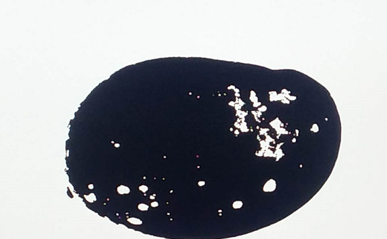

<table class="sphinxhide">
 <tr>
   <td align="center"><h1>Kria&trade; KR260 Robotics Starter Kit</h1>
   </td>
 </tr>
 <tr>
 <td align="center"><h1>Machine Vision Camera Tutorial</h1>
 
 </td>
 </tr>
</table>

# Hardware Architecture of the Accelerator

The AMD Vitis&trade; overlay includes the Pre-Process block and the MV-Defect-Detect blocks.

## Pre-Process

The Pre-Process pipeline reads a video frame from memory, processes it as required for the MV-Defect Detect function, and writes it back to memory. The Pre-Process pipeline consists of the Gaussian + OTSU accelerator and the Threshold + Median accelerator.

In case of the color sensor, additionally a Vitis color conversion function is used to convert the BGR8 video frame from the capture pipeline to a Y8 frame before streaming it to the Gaussian function. 

Gaussian + OTSU accelerator:

The Gaussian + OTSU accelerator consists of two Vitis Vision kernel functions whose parameters can be configured using AXI-Lite based register interface.  

* The grey scale image is fed to the Gaussian_OTSU accelerator. Gaussian filter smoothens the image and affects the edges of the image. 

* OTSU threshold is used to automatically perform clustering-based image thresholding or the reduction of a gray-level image to a binary image.

Threshold and Median accelerator:

This Threshold + Median accelerator also consists of two Vitis Vision kernel functions whose parameters can be configured using AXI-Lite based register interface. 

* The grey-scale image from the Gaussian/OTSU pipeline should be converted to a binary image with a specific threshold value. The Threshold function in the Vitis Vision library is used to perform this operation and yields an image that has a black background and a mango area that is white.

* The Median filter acts as a non-linear digital filter that improves noise reduction. A filter size of N would output the median value of the NxN neighborhood pixel values, for each pixel. In this design, N is set to 3.

An example output image after passing through the Pre-Process accelerators is as follows:

> ***Note***: This proprietary image is from [Cofilab site](http://www.cofilab.com/wp-content/downloads/DB_Mango.rar).

## Defect Detection

The block in the MV-Defect-Detect accelerator reads a video frame from memory, processes it, and writes it back to memory. The MV-Defect-Detect data flow is as shown below:

In hardware, the processing is done in two passes. In pass 1, the forward and reverse passes are computed in parallel. 
Two input pointers are used, which point to the same video data in the DDR, one for forward and other for reverse (two parallel ports are required because the forward and reverse computations are done in parallel). 

The output from the forward and the reverse passes are written back to the DDR buffers. 

Pass 2 reads the data from the same ports once the write into the DDR buffer is complete from pass 1.  The ADDing function detects the defective pixels and output defect pixels are then written to the DDR.

An example output image after CCA Acceleration is done is as follows:

> ***Note***: This proprietary image is from [Cofilab site](http://www.cofilab.com/wp-content/downloads/DB_Mango.rar).

For more information on the functions used in this design refer to the [Vitis Vision user guide](https://docs.amd.com/r/en-US/Vitis_Libraries/vision/index.html)

## Resource Utilization

Vitis integrates the pre-processing functions and mv-defect-detection function into the platform. The following table shows utilization numbers post implementation.

**Color**:

|K26			              |CLB		  |BRAM	    |URAM	    |DSP	    |
|----			              |----		  |---	    |--	      |----	    |
|Available		          |117120		|144	    |64	      |1248	    |	
|Gaussian_OTSU	        |13817		|10.5	    |0	      |83	      |
|Pre-processing		      |6969		  |3.5	    |0	      |8	      |
|CCA			              |5743		  |5	      |0	      |5	      |
|Platform + accelerators|76471		|119	    |14	      |263	    |
|Total %		            |65.29%		|82.64%	  |21.88%	  |21.07%	  |	  

**Mono**:

|K26			              |CLB		  |BRAM	    |URAM	    |DSP	    |
|----			              |----		  |---	    |--	      |----	    |
|Available		          |117120		|144	    |64	      |1248	    |	
|Gaussian_OTSU	        |11461		|7.5	    |0	      |71	      |
|Pre-processing		      |6971		  |3.5	    |0	      |8	      |
|CCA			              |5736		  |5	      |0	      |5	      |
|Platform + accelerators|59336		|99 	    |6	      |111	    |
|Total %		            |50.69%		|68.75%	  |9.38%	  |8.89%	  |	 

 

## Next Steps

* [Software Architecture of the Accelerator](sw_arch_accel_dd.md)
* Go back to the [Hardware Architecture of the Platform](10gige.md)

## References

* https://github.com/Xilinx/Vitis_Libraries/tree/master/vision
* https://docs.amd.com/r/en-US/Vitis_Libraries/vision/index.html

Copyright © 2023–2024 Advanced Micro Devices, Inc.

<a href="https://www.amd.com/en/corporate/copyright">Terms and Conditions</a>

