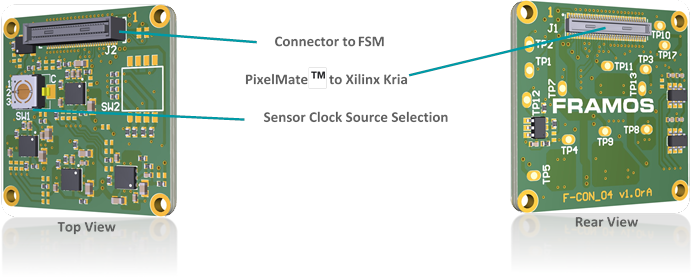
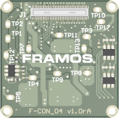

<table class="sphinxhide">
 <tr>
   <td align="center"><h1>Kria&trade; KR260 Robotics Starter Kit</h1>
   </td>
 </tr>
 <tr>
 <td align="center"><h1>Machine Vision Camera Tutorial</h1>
 
 </td>
 </tr>
</table>

# FRAMOS KRIA Documentation

## Overview of Sony IMX547 Sensor

The Sony IMX547 is a diagonal 8.8 mm (Type 1/1.8) CMOS active pixel, solid-state image sensor with a square pixel array and 5.10 M effective pixels. This image sensor contains a global shutter with variable charge-integration time and is part of the Pregius S active pixel-type CMOS image sensors. By stacking the signal processing on the back-illuminated type CMOS Image Sensor, it realizes small chip size and high sensitivity, whilst using the high picture quality global shutter pixel technology of Pregius.

## Overview of FSA (Framos Sensor Adapter) Module

The FSA (Framos Sensor Adapter) connects to the FSM (Framos Sensor Module) supporting Sub-LVDS, SLVS, or SLVS-EC devices.

### Functional Blocks

- Signal routing
- Voltage generation for image sensor
- Power up sequence for image sensor

 

The following table shows the selection of Sensor Clock Source on FSA-FTx/A-V1:

| Position | Description                       |
|----------|-----------------------------------|
| 1        | Clock Provided from FSA (Default) |
| 2        | External Clock 1 (MCLK0)          |
| 3        | External Clock 2 (MCLK1)          |

> ***Note***: The above clock setting is not applicable for FSM used along with KR260.

### PixelMate™ - Sub-LVDS, SLVS and SLVS-EC Pinout

This pinout scheme applies to all sensors that natively output image data using signals according to Sub-LVDS, SLVS, or SLVS-EC specification. This layout provides eight data lanes on the connector. Devices with SLVS and SLVS-EC share the same sensor package pins. Therefore, share the same connector pins.

The following table shows the position of each signal on the 60-pin connector in case the image sensor provides it. For further details, refer to the image sensor Datasheet.

> ***Note***: Lane number assignment is applied according to the SLVS numbering, which, in most cases, differs from the SLVS-EC lane numbering. Refer to the image sensor datasheet for correct SLVS-EC numbering.

The following table shows the general signal assignment that applies to all connections using PixelMate™.

| Pin #      | Type                                       | Signal             | Pin #      | Type                                       | Signal             |
|------------|--------------------------------------------|--------------------|------------|--------------------------------------------|--------------------|
|     1      | Common Voltages (from FPA to FSA)          |     3V8            |     2      | Common Voltages (from FPA to FSA)          |     1V8            |
|     3      | Common Voltages (from FPA to FSA)          |     3V8            |     4      | Common Voltages (from FPA to FSA)          |     1V8            |
|     5      | Sensor Specific Voltages (from FSA to FSM) |     V_ANA          |     6      | Sensor Specific Voltages (from FSA to FSM) |     V_DIG          |
|     7      | Sensor Specific Voltages (from FSA to FSM) |     V_ANA          |     8      | Sensor Specific Voltages (from FSA to FSM) |     V_DIG          |
|     9      | Sensor Specific Voltages (from FSA to FSM) |     V_IF           |     10     | Sensor Specific Voltages (from FSA to FSM) |     V_AUX          |
|     11     |                                            |     GND            |     12     |                                            |     GND            |
|     13     |                                            |     GND            |     14     |                                            |     GND            |
|     15     | Sensor Signals                             |     SDA            |     16     | Sensor Signals                             |     SCL            |
|     17     | Sensor Signals                             |     SDO            |     18     | Sensor Signals                             |     XCE            |
|     19     | Sensor Signals                             |     TOUT0          |     20     | Sensor Signals                             |     SLAMODE        |
|     21     | Sensor Signals                             |     TOUT1          |     22     | Sensor Signals                             |     XMASTER        |
|     23     | Sensor Signals                             |     TOUT2          |     24     | Sensor Signals                             |     NC             |
|     25     | Sensor Signals                             |     NC             |     26     | Sensor Signals                             |     XTRIG          |
|     27     | Sensor Signals                             |     NC             |     28     | Sensor Signals                             |     XHS            |
|     29     | Sensor Signals                             |     NC             |     30     | Sensor Signals                             |     XVS            |
|     31     | Sensor Signals                             |     GND            |     32     | Sensor Signals                             |     GND            |
|     33     | Sensor Signals                             |     RST            |     34     | Data Lines                                 |     D_DATA_7_P     |
|     35     | Driving Clock                              |     MCLK           |     36     | Data Lines                                 |     D_DATA_7_N     |
|     37     |                                            |     GND            |     38     |                                            |     GND            |
|     39     | Data Lines                                 |     D_DATA_6_P     |     40     | Data Lines                                 |     D_DATA_5_P     |
|     41     | Data Lines                                 |     D_DATA_6_N     |     42     | Data Lines                                 |     D_DATA_5_N     |
|     43     |                                            |     GND            |     44     |                                            |     GND            |
|     45     | Data Lines                                 |     D_DATA_4_P     |     46     | Data Lines                                 |     D_DATA_3_P     |
|     47     | Data Lines                                 |     D_DATA_4_N     |     48     | Data Lines                                 |     D_DATA_3_N     |
|     49     |                                            |     GND            |     50     |                                            |     GND            |
|     51     | Data Lines                                 |     D_DATA_2_P     |     52     | Data Lines                                 |     D_DATA_1_P     |
|     53     | Data Lines                                 |     D_DATA_2_N     |     54     | Data Lines                                 |     D_DATA_1_N     |
|     55     |                                            |     GND            |     56     |                                            |     GND            |
|     57     | Data Lines                                 |     D_DATA_0_P     |     58     | Data Lines                                 |     D_CLK_0_P      |
|     59     | Data Lines                                 |     D_DATA_0_N     |     60     | Data Lines                                 |     D_CLK_0_N      |

## Overview of FSM (Framos Sensor Module)

FSM carries the  Sony IMX547 camera sensor, and it is connected to Framos Sensor Adaptor (FSA). Flex cable is used to connect the FSM module with the KR260 carrier card. Its specification are as follows.

### Model Name

|               |                |
|---------------|----------------|
| Model Name    | FSM-IMX547 c/m |

### Image Sensor

|                        |                                      |
|------------------------|--------------------------------------|
| Vendor / Name          | Sony IMX547-AAMJ / IMX547-AAQJ       |
| Shutter Type           | CMOS Global Shutter                  |
| Technology / Grade     | Pregius S (Gen4) / Industrial        |
| Chromaticity           | Color / Mono                         |
| Optical Format         | 1/1.8"                               |
| Pixel Size             | 2.74 x 2.74 µm                       |
| Max. Resolution        | 5.1 Mpx / 2472 x 2128   px           |
| Framerate (max.)       | 122 FPS (2-Lane) 65 FPS (1-Lane)     |
| Bit Depth(s)           | 8 / 10 / 12 bit                      |

### FSM Interface

| Data Interface          | SLVS-EC (1 / 2 Lane)       |
|-------------------------|----------------------------|
| Data Interface          | SLVS-EC (1 / 2 Lane)       |
| Communication Interface | I²C (4-wire serial)        |
| Drive Frequency(s)      | 37.125 / 54 / 74.25 MHz    |
| Input Voltages          | 1.1V, 1.8V, 2.9V, 3.3V     |
| Interface Connector     | Hirose DF40C-60DP-0.4V(51) |
| EEPROM (Sensor ID)      | Yes                        |

### Mechanical

|                    |             |
|--------------------|-------------|
| Dimensions (HxW) | 28mm x 28mm |

### Environmental

|                       |                                                        |
|-----------------------|--------------------------------------------------------|
| Operating Temperature | -30°C to +75°C (function) -10°C to +60°C (performance) |
| Storage Temperature   | -40°C to +85°C                                         |
| Ambient Humidity      | 20% to 95% RH, non-condensing                          |

## Overview of Framos SLVS-EC IP Core

The SLVS-EC interface standard has emerged as the high-speed interface for image sensors from Sony. SLVS-EC v2.0 interface throughput is up to 5 Gbps per lane at great signal integrity, which is double the times of previous SLVS-EC interface 1.2. Engineers developing solutions using AMD FPGAs and SoCs can take advantage of FRAMOS's SLVS-EC RX IP Core, Development Kit, and tested source code examples. Device builders and camera vendors can de-risk the design while reaping the benefits of Sony's latest high-speed interface.

### Key Benefits & Features

- Byte-to-pixel conversion for SLVS-EC v1.2 / v2.0

- De-risk integration, reduce time to market

- Reference implementation for evaluation and guidance

- Flexible Lane Support in one IP CoreSupport for all supported RAW bit-depths

- Error correction and ROI overlap support

- AXI4 communication and control

Internal Structure of the SLVS-EC RX IP Core:

The SLVS-EC RX IP Core processes the incoming deserialized SLVS-EC packets and outputs the reconstructed pixels on the Output Data Interface. In addition, depending on the core variant, IP Core performs error detection (CRC core variant) or error correction (ECC core variant) on payload data.

### Port Descriptions

The SLVS-EC RX IP Core ports are listed in the following table, where `LANE_NUM` represents the number of lanes.

| Signal        | Direction | Width            | Description                          |
|---------------|-----------|------------------|--------------------------------------|
| data_clk_i    | Input     | 1                | Data clock input                     |
| rstn_i        | Input     | 1                | Active low reset                     |
| AXI4-Lite     | InOut     | -                | AXI4-Lite slave interface            |
| data_i        | Input     | 16*`LANE_NUM`    | Input parallel data from transceiver |
| rxdatak_i     | Input     | 2*`LANE_NUM`     | Special character detection input    |
| XCVR_status_i | Input     | 1                | Transceiver status                   |
| fv_o          | Output    | 1                | Frame valid output                   |
| lv_o          | Output    | 1                | Line valid output                    |
| dv_o          | Output    | 1                | Data valid output                    |
| data_o        | Output    | 2 * 16 *`LANE_NUM`  | Parallel pixel data output           |
| lnum_o        | Output    | 13               | Line number output                   |
| ebdl_o        | Output    | 1                | Embedded valid output                |
|  did_o        | Output    | 4                | Data ID output                       |
| hit_o         | Output    | 3                | Header info type output              |
| hinf_o        | Output    | 24               | Header information output            |
| status_o      | Output    | 8                | Core status output                   |

### Framos IPs license

For more information about how the Framos SLVS-EC RX IP-Core would benefit your next project and to request full SLVS-EC IP-Core integration support, contact the Framos imaging experts at <sales@framos.com>.

## Next Steps

- Go back to the [Hardware Architecture of the Platform](10gige.md)

Copyright © 2023–2024 Advanced Micro Devices, Inc.

<a href="https://www.amd.com/en/corporate/copyright">Terms and Conditions</a>

