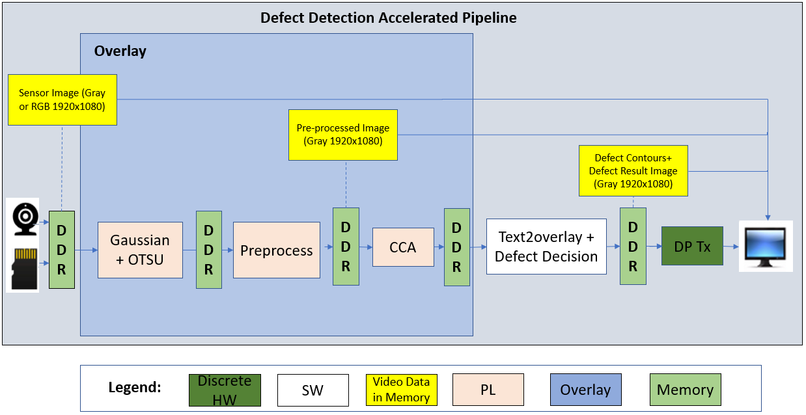
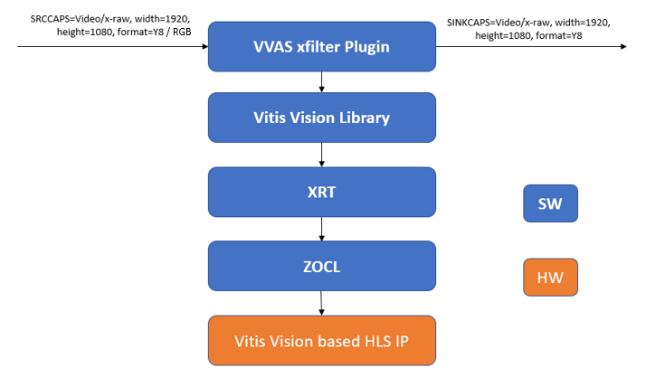
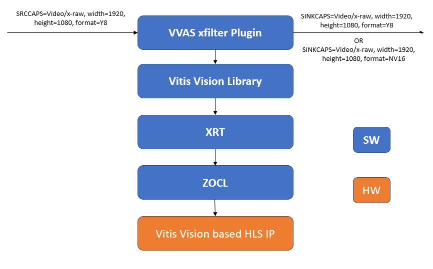
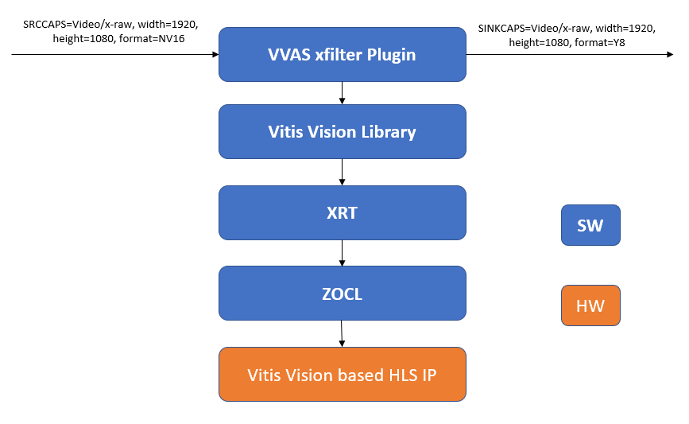
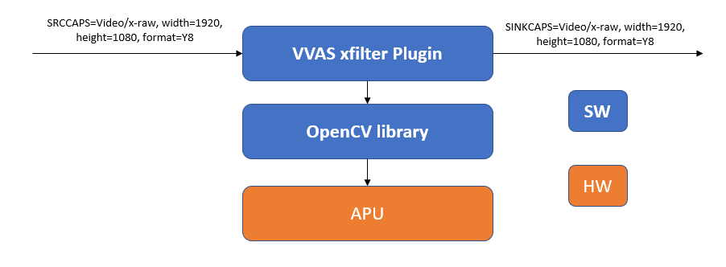
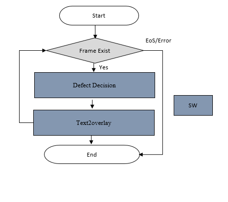

<table class="sphinxhide">
 <tr>
   <td align="center"><h1>Kria&trade; KR260 Robotics Starter Kit</h1>
   </td>
 </tr>
 <tr>
 <td align="center"><h1>Machine Vision Camera Tutorial</h1>

 </td>
 </tr>
</table>

# Software Architecture of the Accelerator

## Introduction

The MV-Defect-Detect application can take video input from a live or a file source. Two separate designs (and thus bitstreams) are provided, one supports monochrome input (GRAY), the other support color input (RGB). The image to be displayed can be taken from various stages of the pipeline: directly from the source (Gray or Color depending on the sensor), after the preprocessing stage, or after the cca plus text overlay stage. The AMD Vitis&trade; overlay includes Vitis Vision libraries that process the frames and detect defects in mangoes.

In this reference design, the resolution of the input frames is 1920x1080, and the outputs are 1920x1080 on a 1080p display. If an image sensor is used instead of file source, the sensor resolution is fixed at 2472x2128. As part of the sensor capture pipeline, 64 lines of optical black at the top of the image are cropped resulting in 2472x2064; after that the ISP downsizes the image to 1920x1080, in case of color sensor debayers the image, and generally improves the image quality.



The source and sink pipeline elements are standard GStreamer plugins, such as *filesrc* for file input, *v4l2src* for camera capture, *kmssink* for the display, or *filesink* for file output. Refer to the [GStreamer documentation](https://gstreamer.freedesktop.org/documentation/tutorials/index.html?gi-language=c) for detailed usage.

## VVAS Plugins

The core acceleration tasks are performed by the, Otsu, Pre-Process and CCA libraries, which are developed by AMD based on the Vitis Vision library functions. The following table lists the VVAS GStreamer plugins used in this application.

| Kernel Name | GStreamer Plugin | Description | Resource Type |
| ----------- | ---------------- | ----------- | ------------- |
| Otsu | VVAS xfilter | Vitis Vision library for the Gaussian + OTSU detector. Preserves edges while smoothening and calculates the optimum threshold between foreground and background pixels. | PL |
| Preprocess | VVAS xfilter | Vitis Vision library to convert a gray-scale image to a binary image and filter out noise from the image. | PL |
| CCA | VVAS xfilter | Vitis Vision library to determine the defective pixels in the image. | PL |
| Text2Overlay | VVAS xfilter | *OpenCV* software library to calculate the defect density, determine the quality of the mango, and embed text as result into output images. | SW |

Each VVAS kernel library uses a configuration file in JSON format to read in static kernel
paramaters. There are two separate sets of configuration files, one set for the mono sensor,
the other set for the color sensor. The content of the files is identical except for the xclbin
path which is different depending on the sensor used. The below conifguration file snippets are
based on the mono sensor variants.
\10gige_vision_camera\docs
A common VVAS user meta data structure is defined [here](https://github.com/Xilinx/mv-defect-detect/blob/master/defect-detect/src/vvas_dd_meta.h).
It is used to exchange data between the individual kernels in the defect detect pipeline and
consists if the following fields:

* threshold: threshold value generated by the Otsu kernel
* mango pixels: number of total mango pixels; generated by Preprocess kernel
* defect pixels: number of defective mango pixels; generated by CCA kernel

### Gaussian_OTSU Accelerator

This kernel has two or three functions depending on whether the mono or color design is used:
RGB-to-Gray conversion (color variant only), Gaussian and OTSU; all functions are connected in
a streaming fashion.

In general, any smoothing filter smoothens the image, and affects the edges of the image. To
preserve the edges while smoothing, use a bilateral filter. In an analogous way as the
Gaussian filter, the bilateral filter also considers the neighboring pixels with weights assigned
to each of them. These weights have two components, the first of which is the same weighing used
by the Gaussian filter; the second component takes into account the difference in the intensity
between the neighbouring pixels and the evaluated one.

OTSU threshold is used to automatically perform clustering-based image thresholding or the
reduction of a gray-level image to a binary image. The algorithm assumes that the image contains
two classes of pixels following a bi-modal histogram (foreground pixels and background pixels), it
then calculates the optimum threshold separating the two classes.

The RGB-to-gray converter is used to convert the incoming RGB image to gray format for further
processing by the Gaussian and OTSU functions. The conversion parameters are hard-coded inside
the kernel library but configurable at the hardware kernel level.

The following figure depicts the Gaussian + OSTSU plugin software stack.



The following figure depicts the Gaussian + OTSU plugin data flow.


#### Kernel Interface

The Otsu kernel has the following programming interface:

* Image buffer pointer (input): Y8 (Gray) or RGB format depending on the design variant
* Image buffer pointer (output): Y8 (Gray) format
* Image height (input): set to 1080 by application code
* Image width (input): set to 1920 by application code
* Sigma (input): set to default value of 0.0 by kernel library code
* Threshold (output): threshold value calculated by otsu
* bgr2y8 (input): array of configuration paramaters for format RGB-to-Gray format conversion

The Otsu kernel recieves and input image from the source plugin which can be either *filesrc*
or *v4l2src*. The input image pointer is extracted from the GST buffer object and passed down to
the kernel.

After the kernel completes, the output image is wrapped as a GST buffer object and sent to the
preprocess kernel. The otsu threshold value is wrapped a custom VVAS usr meta object and attached
to the GST buffer object.

#### Configuration File

The *otsu-accelerator.json* file is as follows:

```
{
  "xclbin-location": "/lib/firmware/xilinx/kr260-mv-camera-mono/kr260-mv-camera-mono.xclbin",
  "vvas-library-repo": "/opt/xilinx/xlnx-app-kr260-mv-defect-detect/lib",
  "element-mode": "transform",
  "kernels": [
    {
      "kernel-name": "gaussian_otsu_accel:{gaussian_otsu_accel_1}",
      "library-name": "libvvas_otsu.so",
      "config": {
        "debug_level" : 1
      }
    }
  ]
}

```
Configuration parameters:

* debug_level: Enable or disable debug log for the Kernel library.

### Preprocess Accelerator

The gray-scale image should be converted into a binary image with an appropriate threshold value.
The threshold function in the Vitis Vision library can perform the thresholding operation on the
input image. This yields an image that has a black background with the mango area in white.

The median blur filter acts as a non-linear digital filter that reduces noise. A filter size of N
outputs the median of the NxN neighborhood pixel values for each pixel. In this design, N is 3.

This plugin accepts the 1920x1080 Y8 image as input. The plugin applies the threshold binary
algorithm to convert the Y8 image to binary image by using the threshold value of the pixel.
Later, it applies the Median filter to remove salt and pepper noise.

For performance reasons, this kernel also performs part of the CCA operation, specifically the
forward pass. Both the threshold image as well as the CCA forward pass image are passed to the
CCA kernel.

The following figure depicts the Threshold + Median plugin software stack.



The following figure depicts the Threshold + Median plugin data flow.


#### Kernel Interface

The Preprocess kernel has the following programming interface:

* Image buffer pointer (input): Y8 (Gray) format
* Image buffer pointer plane 0 (output): Y8 (Gray) format or first plane of NV16 format
* Image buffer pointer plane 1 (output): second plane of NV16 format
* Mango Pixels (output): number of total mango pixels
* Threshold (input): Otsu threshold value
* Max_value (input): set to default value of 255, configurable through JSON file
* Image height (input): set to 1080 by application code
* Image width (input): set to 1920 by application code
* Image stride (input): set to 1920 or 2048 based on respective JSON config file

The preprocess kernel receives an input image along with attached user meta from the otsu kernel.
The image buffer pointer and the otsu threshold value are extracted from the GST buffer and user
meta data object and passed down to the kernel.

After the kernel completes, the output image is wrapped as a GST buffer object and sent
to the next down stream kernel which can be either the cca kernel or a sink kernel like
*filesink* or *kmssink* for display. If the next kernel is a sink element, the output format is
set to Y8 (Gray); if the next kernel is the cca element, the output format is set to NV16. If the
sink element is a display, the stride value is set to 2048, otherwise it is set to 1920.
The stride value is obtained by selecting the respective JSON file via the kernels-config property.

When targeting a sink element, only the plane0 image output buffer generated by the binary
thresholding function is passed on as a Y8 buffer; the plane1 image output buffer generated by
the CCA forward pass function is written to a temporary buffer that is unused. When targeting
the CCA element, both the plane0 and plane1 buffers are transferred as a semi-planar NV16 buffer.
Both planes are consumed by the CCA kernel fo further processing.

The produced *Mango Pixels* value representing the total number of pixels associated with the
mango is wrapped as custom VVAS user meta object and attached to the GST buffer object.

#### Configuration File

The *preprocess-accelerator.json* and *preprocess-accelerator-stride.json* files are as follows:

```
{
  "xclbin-location": "/lib/firmware/xilinx/kr260-mv-camera-mono/kr260-mv-camera-mono.xclbin",
  "vvas-library-repo": "/opt/xilinx/xlnx-app-kr260-mv-defect-detect/lib",
  "element-mode": "transform",
  "kernels": [
    {
      "kernel-name": "preprocess_accel:{preprocess_accel_1}",
      "library-name": "libvvas_preprocess.so",
      "config": {
        "debug_level" : 1,
        "max_value": 255,
        "stride_value": 2048
      }
    }
  ]
}

```

Configuration parameters:

* debug_level: Enable or disable debug log for the Kernel library.
* max_value: Maximum value to use with the THRESH_BINARY thresholding types.
  For more information, click [here](https://docs.opencv.org/master/d7/d1b/group__imgproc__misc.html#gae8a4a146d1ca78c626a53577199e9c57).
* stride_value: stride value in bytes; only present in *preprocess-accelerator-stride.json* file.
  only used when sending output to the display.

### CCA Accelerator

The implemented Connected Component Analysis (CCA), is a custom solution to find the defective
pixels in the problem object. This algorithm considers few assumptions that the background must be
easily separable from the foreground object.

The custom CCA effectively analyses the components that are connected to the background pixels and
removes the background from the object and defective pixels. The aim is to send the following
output information from the function:

* defect image: image with only defect pixels marked as ‘255’ and both object pixels and background as ‘0’
* object_pixels: total pixels of the object
* defect_pixels: total defective pixels of the object

For performance reasons, the CCA operation is split across the preprocess and the cca kernels. The
CCA forward pass is performed as part of the preprocess kernel whereas the CCA reverse pass along
with the AND'ing of the two passes is performed as part of this kernel.

The following figure depicts the CCA plugin software stack.



The following figure depicts the CCA plugin data flow.


#### Kernel Interface

The CCA kernel has the following programming interface:

* Image buffer pointer plane 0 (input): first plane of NV16 format
* Image buffer pointer plane 1 (input): second plane of NV16 format
* Image buffer pointer (output): Y8 (Gray) format
* Defect Pixels (output): number of defective mango pixels
* Image height (input): set to 1080 by application code
* Image width (input): set to 1920 by application code
* Image stride (input): set to 1920 or 2048 based on respective JSON config file

The CCA kernel receives a semi-planar input image in NV16 format which really contains two Y8
images: the first plane contains the threshold image, the second plane contains the CCA forward
pass image plane. Attached to the buffer is the VVAS user meta from the otsu kernel. The pointers
to the two planes of the image buffer are extracted from the GST buffer and passed down to the
kernel.

After the kernel completes, the output image is wrapped as a GST buffer object and sent
to the *text2overlay* kernel. If the following sink element is the *kmssink* display element,
the stride value is set to 2048, otherwise it is set to 1920. This is done by selecting the
respective JSON file.

The *Mango Pixels* value is extracted from the incoming user meta object from the preprocess
kernel and copied into a new outgoing user meta object to be passed to the next element. In
addition, the generated *Defect Pixels* value generated by the cca function, representing the
total number of defective pixels in the mango, is copied into the same VVAS user meta object and
attached to the GST buffer.

#### Configuration File

The *cca-accelarator.json* and *cca-accelarator-stride.json* files are as follows:

```
{
  "xclbin-location": "/lib/firmware/xilinx/kr260-mv-camera-mono/kr260-mv-camera-mono.xclbin",
  "vvas-library-repo": "/opt/xilinx/xlnx-app-kr260-mv-defect-detect/lib",
  "element-mode": "transform",
  "kernels": [
    {
      "kernel-name": "cca_custom_accel:{cca_custom_accel_1}",
      "library-name": "libvvas_cca.so",
      "config": {
        "debug_level" : 1,
        "stride_value" : 2048
      }
    }
  ]
}
```

Configuration parameters:

* debug_level: Enable or disable debug log for the Kernel library.
* stride_value: stride value in bytes; only present in *cca-accelerator-stride.json* file.
  only used when sending output to the display.

### Defect Decision Text Overlay

The output of the CCA plugin is fed into the Defect Decision block, which determines the defect density and decides the quality of the mango. The block performs the following main operations:

* The ratio of blemished pixels to total mango pixels is calculated to determine how much of the mango's surface area is covered with blemishes.
* Defect Decision determines whether the ratio exceeds a user-defined, configurable threshold, to decide whether the mango is defected or not.
* The results are embedded in the image as text overlay and the output is fed to the next plugin for the display.

The following figure depicts the Defect Decision plugin software stack.



The following figure depicts the Defect Decision plugin data flow.



#### Kernel Interface

The text2overlay is a pure SW implemented using OpenCV functions; it does not have a hardware
kernel associated with it and thus no kernel programming interface.

The text2overlay kernel receives an input image in Y8 format along with attached VVAS user meta
from the CCA kernel extracted form the GST buffer object.

From the user meta objecte, the *Mango Pixels* and the *Defect Pixels* values are extracted to
calculate defect density and defect decision. The defect density is calculated as total number of
mango pixels divided by defective mango pixels. The defect decision is a boolean values set to
true if the defect density is greater than the defect threshold, or false otherwise. The defect
theshold is configurable through the JSON file; it is determined by calibrating the algorithm
against a golden data set.

Finally, the defect density and defect decision values are embedded into the input image as
text overlay using standard OpenCV functions. The modified input image is passed on to the
output of this element to be consumed by the sink element (in-place transformation).

#### Configuration File

The *text2overlay.json* file is as follows:

```
{
  "xclbin-location": "/lib/firmware/xilinx/kr260-mv-camera-mono/kr260-mv-camera-mono.xclbin",
  "vvas-library-repo": "/opt/xilinx/xlnx-app-kr260-mv-defect-detect/lib",
  "element-mode":"inplace",
  "kernels" :[
    {
      "library-name":"libvvas_text2overlay.so",
      "config": {
        "debug_level" : 1,
        "font_size" : 1.0,
        "font" : 3,
        "x_offset" : 0,
        "y_offset" : 100,
        "defect_threshold" : 0.14,
        "is_acc_result" : 0
      }
    }
  ]
}
```

Configuration parameters:

* debug_level: Enable or disable debug log for the Kernel library.
* font_size: User configuration to change the font size.
* font: User configuration to change the supported font type.
* x_offset: The X co-ordinate from where the text starts writing.
* y_offset: The Y co-ordinate from where the text starts writing.
* defect_threshold: The defect density threshold to calculate the defect. If the defect value is  more than the threshold, it falls under defect category.
* is_acc_result: Flag to display the accumulated result. If the value is 0, then the accumulated result will not be displayed.
For more information [see](https://docs.opencv.org/3.4/d0/de1/group__core.html#ga0f9314ea6e35f99bb23f29567fc16e11).

## Next Steps

* Go back to the [Hardware Architecture of the Accelerator](hw_arch_accel_dd.md)
* Go back to the [Software Architecture of the Platform](sw_arch_platform_dd.md)


<hr class="sphinxhide"></hr>

<p class="sphinxhide" align="center"><sub>Copyright © 2023–2024 Advanced Micro Devices, Inc.</sub></p>

<p class="sphinxhide" align="center"><sup><a href="https://www.amd.com/en/corporate/copyright">Terms and Conditions</a></sup></p>

